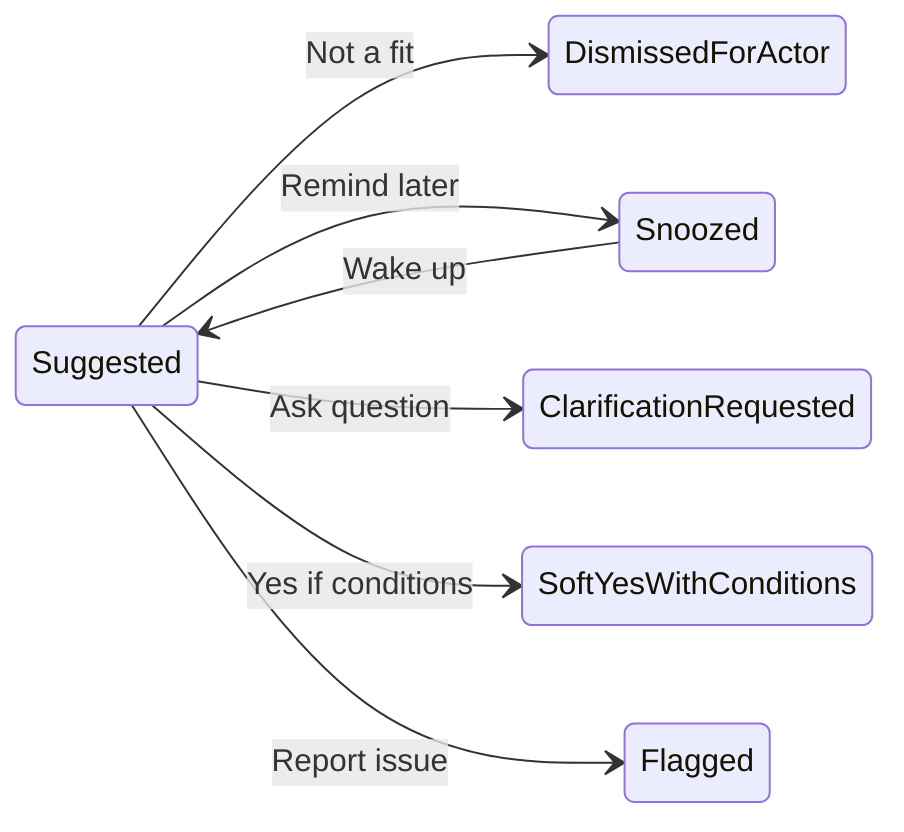

# Match first-action workflows (pre-acceptance)

## Current product anchor

- Matches are **system-suggested pairs** ([`matching.matches`](c:\dev\knapsack\api\src\db\migrations\002_matching.sql): `score`, `rationale`, `strategy`, `matched_at`; one row per pair).
- The web app **surfaces** matches to anyone who **owns the need or the resource** ([`api/src/matches/router.ts`](c:\dev\knapsack\api\src\matches\router.ts)); [`web/src/pages/matches/index.tsx`](c:\dev\knapsack\web\src\pages\matches\index.tsx) is largely **informational** (links + rationale + “New”), with **no** per-user decision yet beyond `seen_at` ([`matching.match_views`](c:\dev\knapsack\api\src\matches\router.ts) pattern).

## MVP scope (locked): human-only

- **Actors:** People signed into the product (need owner and/or resource owner as today). No first-class **service accounts**, **integration actors**, or **webhook-driven** decision loop in MVP.
- **Surfaces:** **Web UI** as the primary place to act on a match; **in-app** notifications are in scope; **email** nudges optional. No partner-facing **HTTP API** or **outbound webhooks** for “match suggested / match decided” required for MVP.
- **Go-live bar:** A **match-scoped conversation** (see todo `match-conversation-phase` and *Reconciliation* §B) is part of the **MVP**—you would not go live without it. **Implementation order** can still be “scaffold other actions first, then thread”—only **scope**, not **priority in one sitting**, is fixed.
- **Payloads:** Prefer **simple, human-oriented** fields (free text, short picklists). You may still store decisions in normalized tables for analytics and **future** automation—without exposing that as a public integration contract yet.
- **Either side first:** Still assume **either human party** may act first; sometimes **both** must align before a later “accepted / in progress” phase (that phase remains out of scope for this session).
- **Migration policy (dev mode):** Do **not** optimize for preserving existing runtime match/action data across schema changes. Prefer clean, direct migrations (no data backfills/compat shims) and allow resetting dev data between builds; keep only metadata/application bootstrap data as needed.

### Locked (MVP): **soft-yes visibility** and **next phase**

- **Visibility:** When a side saves **soft yes**, **clarify**, or **snooze**, that choice (action + optional details + timestamp) is **visible to the counterparty** as soon as they load the match in the app—no delayed reveal and no separate “publish” step.
- **Next phase:** There is **no** required counterparty acknowledgement before the pair can move forward. **Mutual soft yes** (both owners with `soft_yes`) sets pair status **`mutual_interest`** and is the cue to use the **match-scoped thread** to align on conditions. The thread is the primary coordination surface; a dedicated “confirm mutual interest” control is **not** required for MVP.

### Design decision (locked): **per-side** state

- **Model:** First-action outcomes (dismiss, snooze, clarification, soft yes, flag, etc.) are recorded **per side**: keyed by **match + user** (or **match + role**, e.g. need-side vs resource-side), not a single shared “pair state” row that both parties overwrite.
- **Why:** Each owner may act independently; one party dismissing or snoozing should not silently erase the other’s view unless you explicitly design that (you are **not** doing pair-level overwrite for MVP).
- **Pair-level outcome:** Once you move from **per-side inputs** to a **decided** match, you need a small set of **terminal pair states** (see *Reconciliation* below). Per-side “dismiss for me” remains available until a pair-level close or resolution path runs.

---

## Reconciliation: from per-side actions to pair-level outcomes

This section refines the earlier gap: **per-side** actions eventually produce a **visible outcome for the match** and for each **need** and **resource**.

### A. Hard reject (one or both sides)

- **Trigger:** A side **rejects the match outright** (your “this pairing is not viable”).
- **Pair outcome:** **Close the match** as **rejected** (or equivalent terminal status)—no further matching actions on *this* `matches` row except audit/history.
- **Mutual context (optional but valuable):** Allow **optional feedback** (reason + short free text) that is **visible to both sides** on closure—reduces “ghosting” and improves trust. (Moderation: same surface risks as any shared text; tie to *match-conversation-phase* policy thinking.)
- **Re-listing “on the market”:** Return **need** and **resource** to an **open / matchable** posture (per your product rules: typically **unchanged** if still `open` / `available`, or explicit clear of a “tied to this match” lock if you add one during evaluation). If one party’s listing should change status, define whether reject **only** affects the **pair** or also suggests **editing** the listing (MVP: **pair close only** is simplest).
- **Per-owner “scoring” (signals, not a game):** Log outcome-derived signals for each **owner** (e.g. reject count, time-to-respond, successful paths later) for **trust, ranking, and abuse detection**. **Cold-start and fairness** matter: avoid punishing new users; consider caps, context (who rejected first), and appeals path later.
- **Match-quality feedback for AI:** Persist **this match’s** `score` / `strategy` / `rationale` at decision time and join with **outcome** (rejected, later accepted, etc.) and optional **user labels** (“bad match: wrong category”) to improve **retrieval / re-ranking / prompt eval**—treat as **internal ML/eval** loop first, not a user-facing “rate the bot” unless you want that explicitly.

### B. Reservation / follow-up (not a hard reject)

- **Trigger:** **Soft yes**, **clarify**, or **snooze**-like uncertainty rather than a clean no.
- **Pair outcome (MVP, go-live):** Move into a **match-scoped conversation thread**—bounded to **this** need–resource pair, not a global DM or org-wide product chat. That thread is a **ship blocker** for launch; you may still build **DB/API/UI for reject / close first** and add the thread in a **later implementation slice** in the same MVP effort.
- **Emphasis:** **Moderation** (report, block, admin review queue, report-as-message) and **privacy** (who sees what, retention, export, no accidental PII in notifications, rate limits)—treat as **first-class** with the thread, not an afterthought.

### C. Other conflict scenarios to plan for (now)

Use these to drive **rules and edge-case UX** before you scaffold DB/API/UI; you need not implement all in v1.

1. **Double hard reject** — Symmetric; same terminal path as (A); optional feedback from either or both; avoid duplicate close logic bugs.
2. **Reject vs soft-yes (classic conflict)** — One side out, one still positive: **(A) wins** for the pair: close as rejected; the soft-yes side is notified with reason. Conversation is optional; default is **no forced chat**.
3. **Incompatible soft-yes** (e.g. conditions can’t both hold) — Either **treat as (B)** (open follow-up) or **resolve to (A)** with a specific reason code “conditions incompatible” if you want a fast path without chat.
4. **Reject vs still-snoozed / not-yet-seen** — The reject closes the **pair**; the other side sees **closed** (not a stale “active” match). **Ordering:** **first-class event** is “match closed” so snooze timers don’t resurrect dead pairs.
5. **Flag (trust) + honest counterparty** — **Asymmetric risk:** one side **flags**; pair may go to **moderator hold**; other side may see limited info. Decouple from normal reject flow so **safety** doesn’t look like a normal business decline.
6. **Entity no longer available** (system-driven) — Need closed, resource given elsewhere, dates passed: **auto-close** the match with reason **“listing no longer active”**; no fault scoring default—or **neutral** system outcome.
7. **Race: both act within seconds** — **Idempotency** and **last-writer** rules: e.g. if both reject, still one terminal state; if reject + accept-in-principle land together, product rule picks **reject wins** for pair closure (or your chosen order)—document explicitly in API.
8. **User mistake / narrow undo window** — Optional **“undo dismiss”** within minutes if counterparty hasn’t seen it—**high complexity**; often **defer** or replace with “open a new match” when matcher runs again.
9. **Repeat bad matches (same need–resource re-suggested)** — If matcher re-inserts a rejected pair, **down-rank** or **require cooldown**; stored **reject reason** helps.

---

## Future (post-MVP): automated owners

Need owners and resource owners may later be **programs**: cron jobs, partner integrations, inventory/ERP connectors, or internal services acting on behalf of an org. For that phase, first-action design should not assume a person is at the keyboard.

**Implications**

- **Actor model:** Beyond “user id,” you may need an **owner kind** or **capability set** (e.g. can use UI, can receive webhooks, may only poll). Same match row; different **delivery and input** paths.
- **Channels:** Humans—UI, email, push. Automations—**HTTPS webhooks** (signed), **pollable APIs**, or message queues. “Notifications” for bots are often **event subscriptions** (`match.suggested`, `match.action_required`) with retries and idempotent handlers.
- **Actions as stable contracts:** First actions should map to **versioned, idempotent** operations (e.g. decision endpoints with `Idempotency-Key`) so integrators can retry safely after timeouts.
- **Clarification:** For people, free text; for automation, prefer **structured prompts and responses** (schema-validated fields, reason codes) so downstream systems can answer without NLP. Optional policy hooks (“if question type = availability, reply from field X”).
- **Snooze / defer:** Less “remind me Tuesday”; more **defer-until** semantics—**event-driven** (e.g. after upstream sync), **TTL hold**, or **SLA timer**. Bots may skip snooze entirely.
- **Soft yes / conditions:** Fits **machine evaluation**: conditions as structured data (predicates, thresholds); counterparty automation can **accept**, **reject**, or **counter** with another structured payload. Expose **deterministic reason codes** for logs and UX (“declined: quantity_below_min”).
- **Volume and noise:** Automated owners can create **bursts**; consider **batch/digest** events, **pull-first** APIs, or rate limits so webhooks do not overwhelm receivers.
- **Trust:** Distinguish **who** initiated an action (human session vs integration token vs service role); verify webhook signatures; audit **automation id** when relevant.
- **Mixed pairs (human + bot):** Human side keeps familiar UI; bot side responds quickly or deterministically. Human-facing copy may need **explainability** when the other side is automation (“Declined by partner system: code `INVENTORY_UNAVAILABLE`”).

---

## Dimensions to fix early (informs every workflow)

**MVP:** Optimize the table below for **human** actors and **UI**; treat “integration / owner mode” as **post-MVP** unless you add a thin internal-only hook.

| Dimension | Why it matters |
|-----------|----------------|
| **Actor** | Need owner, resource owner, or platform admin. *(Post-MVP: integration acting for an owner.)* |
| **Owner mode** | *MVP: implicit human.* Post-MVP: human vs automated (and **mixed** pairs): drives channel, payload shape, and SLA. |
| **Visibility** | Is the action private (only me), shared with counterparty, or internal-only? |
| **Effect on the suggestion** | Hide for me, hide for everyone, downgrade score, keep visible but “blocked,” etc. |
| **Reversibility** | Undo within 24h vs permanent audit trail. |
| **State granularity** | **Per-side** until a **pair-level** terminal outcome applies (see *Reconciliation*). |

You do not need to decide these in the plan doc—just ensure each workflow below states implied answers.

---

## Candidate first-action workflows

### 1. Dismiss / not a fit (hard no)

- **Intent:** “This pairing is wrong or useless for me.”
- **Variants:**
  - **Reject for me (MVP default):** **per-side**—stop showing on **my** list / mark dismissed **for this user**; counterparty may still see and act until they dismiss or you add reconciliation rules.
  - **Reject for the pair (strong):** mark the suggestion **suppressed** for **both**—**not** the default in per-side MVP; add later if you need matcher-wide suppression and clear conflict rules with per-side history.
- **Optional capture:** reason taxonomy (wrong category, already fulfilled, duplicate, offensive, other) + free text for matcher feedback.

### 2. Snooze / remind later

- **Intent:** “Maybe later—not ready to decide.”
- **UX:** Resurface after date or next status change (need/resource edited, new quantity, etc.).
- **Distinction from dismiss:** pair stays “live” in principle; only **attention** is deferred.

### 3. Request clarification (async message thread)

- **Intent:** “I’m interested but need more detail before any commitment.”
- **Sides:** Typically the **viewer** asks the **counterparty** (need owner asks resource owner or vice versa).
- **MVP:** Backed by the **match-scoped thread** (see `match-conversation-phase`); first step is an initial **question** with optional structured prompts (availability, location, quantity, condition, timeline)—not full post-acceptance negotiation yet.

### 4. Accept “in principle” with **conditions** (soft yes)

- **Intent:** “Yes if X holds” without starting fulfillment.
- **Examples:** “Yes if pickup can be within 10 miles,” “Yes if quantity is at least N,” “Yes pending photo proof.”
- **Note:** This is **not** full post-acceptance workflow; it’s a **pre-commit gate** that may require counterparty to **confirm** or **counter** conditions.

### 5. “Interested” / poke (minimal signal)

- **Intent:** Low-friction signal when full messaging feels heavy.
- **Behavior:** Notify counterparty; may unlock richer actions (message, propose time window).
- **Risk:** Notification fatigue—often paired with rate limits or batching.

### 6. Save / star (private bookmark)

- **Intent:** “Keep this visible” without signaling the other party.
- **Useful** when users triage many matches.

### 7. Escalate / flag (trust & safety)

- **Intent:** Spam, scam, mismatch with policy, harassment.
- **First action:** flag with category; may **hide** suggestion from actor immediately while review is pending.

### 8. Open detail & defer (implicit)

- **Intent:** User only **opens** need/resource from the match card—no explicit state change.
- **Product:** You already have deep links; you may still want **analytics** as a “workflow” (funnel: view → action).

### 9. Delegate / assign (org use)

- **Intent:** “Send this match to a teammate.”
- **First action:** assignee gets the decision queue; original owner is CC’d or not—policy choice.
- **Automation angle (post-MVP):** Delegate may mean **route to another integration** or **queue for a rules engine**.

---

## Suggested minimal **MVP** palette

A coherent small set for **human UI**, plus a **match-scoped thread** (see `match-conversation-phase`) for clarification and follow-up—**not** a general-purpose chat product, but **required before go-live**.

1. **Dismiss (for me)**  
2. **Snooze** (remind on date and/or when need/resource changes—keep MVP-simple)  
3. **Request clarification** (opens or continues the **match thread**; optional canned prompts)  
4. **Soft yes with conditions** (short free-text or bullet chips; no requirement for a parallel machine-only schema in MVP)  
5. **Flag**  
6. **Match thread** (bounded conversation tied to the pair—moderation and privacy as above)

“Interested” can be folded into soft-yes, clarification, or the thread if you want fewer buttons.

**Post-MVP:** Revisit the same five intents as **idempotent APIs + outbound events**, structured Q&A, and **hold/TTL** semantics for non-human owners (see *Future: automated owners*).

---

## Out of scope

- **This session:** Fulfillment, handoffs, scheduling, shipping, closing the loop after both parties agree, payment, receipts, reputation.
- **Human-only MVP:** Public/partner **APIs** and **webhooks** for match lifecycle; **service-account** owners acting through integrations; **volume/rate** concerns typical of full automation.
- **Deferred (beyond MVP go-live list):** **General-purpose** messaging / DMs, **rich reputation** surface, and **public** “rate the matcher” (internal **matcher-quality** logging may still land early—see *matcher-quality-feedback*). **Match-scoped** thread is **MVP**—not deferred.

---

## Optional diagram (conceptual states)

(**MVP:** Treat states above as **per actor / per side** on the same match; a single global pair state machine is **not** assumed. **Later:** combine per-side views into explicit reconciliation when they diverge.)
